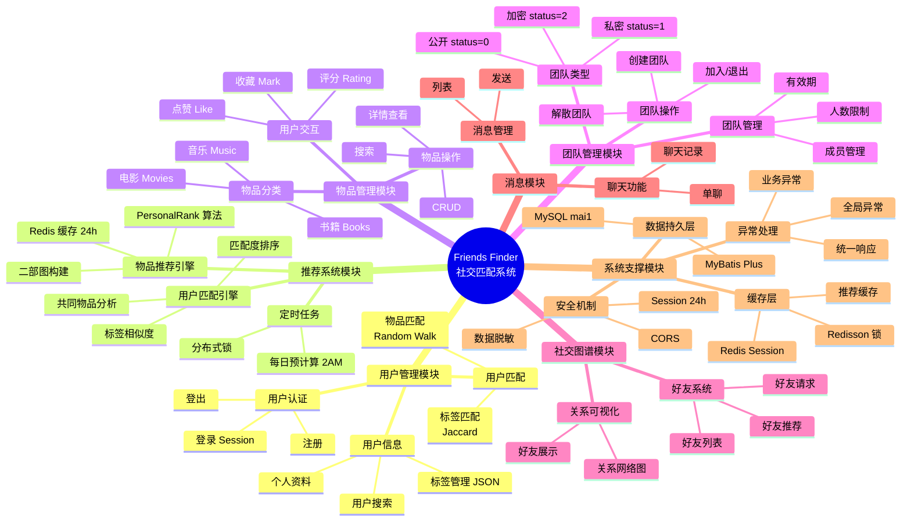
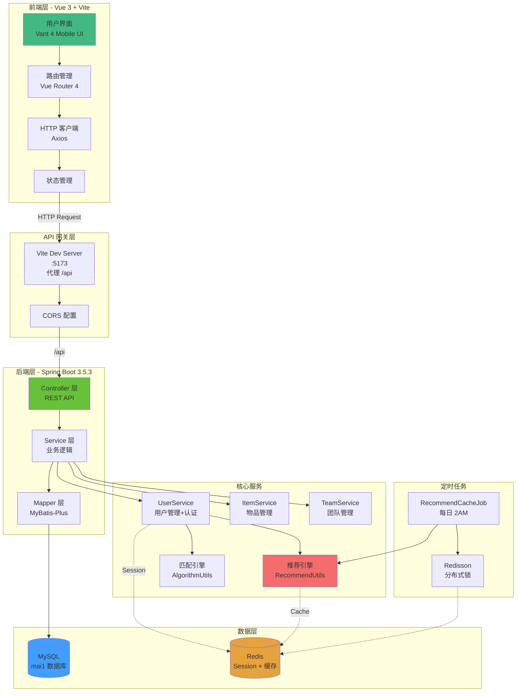
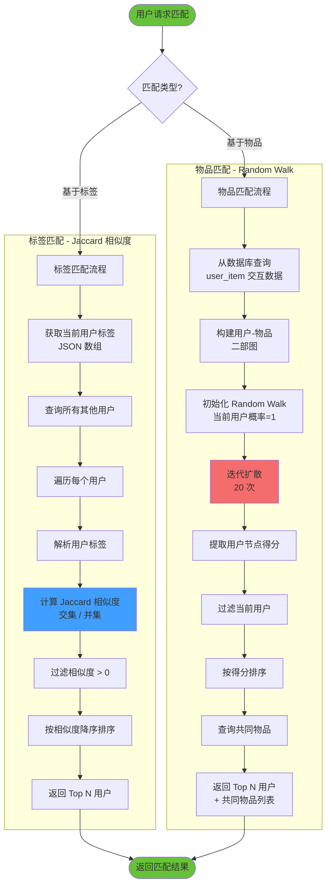
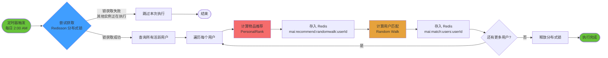
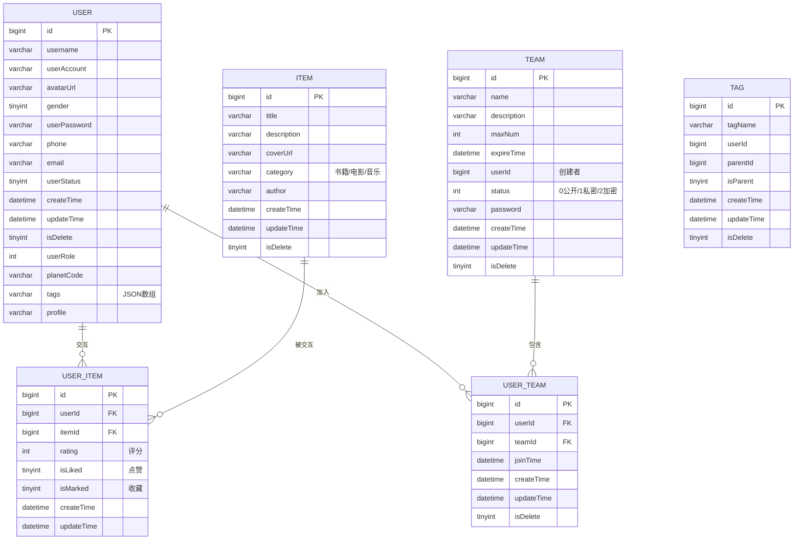
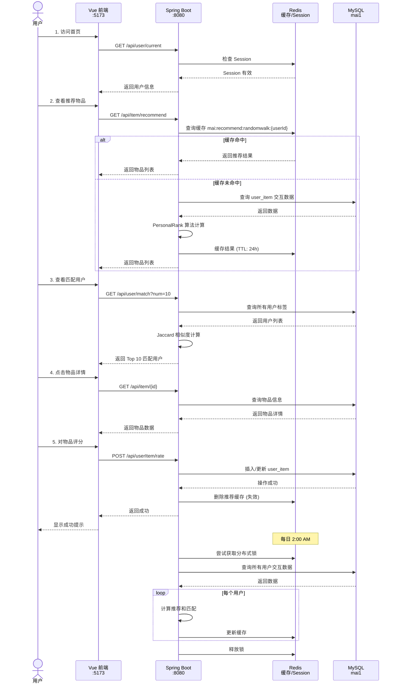
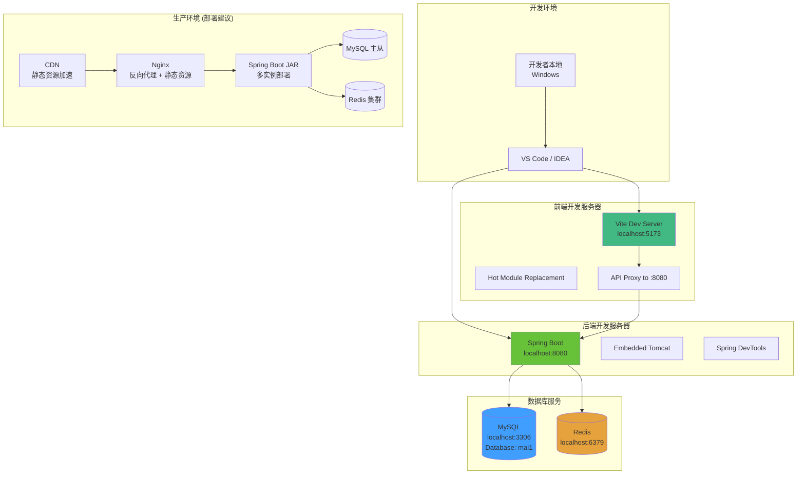

# Friends Finder 系统架构图

本文档包含多个可视化图表，使用 Mermaid 语法生成。

## 如何查看这些图表

### 方法 1: GitHub/GitLab
- 直接在 GitHub 或 GitLab 上查看此文件，图表会自动渲染

### 方法 2: VS Code
- 安装插件: "Markdown Preview Mermaid Support"
- 按 `Ctrl+Shift+V` 预览 Markdown

### 方法 3: 在线工具
- 访问 https://mermaid.live/
- 复制下面的代码块内容到编辑器
- 可导出为 PNG、SVG 等格式

### 方法 4: Typora / Obsidian
- 这些 Markdown 编辑器原生支持 Mermaid

---

## 1. 系统功能模块结构图



---

## 2. 系统技术架构分层图



---

## 3. 物品推荐算法流程图

```mermaid
flowchart TD
    Start([用户请求物品推荐]) --> CheckLogin{用户已登录?}
    CheckLogin -->|否| Error1[返回未登录错误]
    CheckLogin -->|是| GetUserId[获取用户 ID]

    GetUserId --> CheckCache{检查 Redis 缓存<br/>mai:recommend:randomwalk:userId}

    CheckCache -->|缓存命中| ReturnCache[返回缓存的推荐结果]
    ReturnCache --> End([结束])

    CheckCache -->|缓存未命中| FetchData[从数据库查询<br/>user_item 交互数据]

    FetchData --> BuildGraph[构建用户-物品<br/>二部图]

    BuildGraph --> InitPR[初始化 PersonalRank<br/>当前用户概率=1<br/>其他节点概率=0]

    InitPR --> Iterate[迭代计算概率分布<br/>默认 20 次迭代]

    Iterate --> IterateDetail[每次迭代:<br/>1. 概率向邻居扩散<br/>2. 阻尼系数 α=0.8<br/>3. (1-α) 概率回到起点]

    IterateDetail --> FilterItems[过滤已交互物品]

    FilterItems --> SortItems[按概率得分排序]

    SortItems --> TopN[取 Top N 物品]

    TopN --> SaveCache[存入 Redis<br/>TTL: 24 小时]

    SaveCache --> ReturnResult[返回推荐结果]

    ReturnResult --> End

    style Start fill:#67c23a
    style End fill:#67c23a
    style CheckCache fill:#409eff
    style BuildGraph fill:#e6a23c
    style Iterate fill:#f56c6c
    style SaveCache fill:#409eff
```

---

## 4. 用户匹配算法流程图



---

## 5. 定时任务执行流程图



---

## 6. 数据库表关系图



---

## 7. 完整的系统交互时序图



---

## 8. 部署架构图



---

## 图表说明

### 图表 1: 系统功能模块结构图
使用思维导图展示所有功能模块的层级关系，适合快速了解系统全貌。

### 图表 2: 系统技术架构分层图
展示前端、后端、数据层的技术栈和数据流向。

### 图表 3: 物品推荐算法流程图
详细说明 PersonalRank 算法的执行步骤和缓存机制。

### 图表 4: 用户匹配算法流程图
对比展示基于标签和基于物品的两种匹配方式。

### 图表 5: 定时任务执行流程图
说明定时预计算任务如何使用分布式锁防止重复执行。

### 图表 6: 数据库表关系图
展示核心数据表的字段和关系。

### 图表 7: 系统交互时序图
展示用户操作从前端到后端到数据库的完整调用链。

### 图表 8: 部署架构图
展示开发环境和生产环境的部署架构建议。

---

## 导出图表为图片的方法

### 使用 Mermaid Live Editor
1. 访问 https://mermaid.live/
2. 复制任意图表代码到编辑器
3. 点击右上角 "Download" 按钮
4. 选择格式: PNG (推荐) / SVG / PDF

### 使用 VS Code
1. 安装插件: "Markdown Preview Mermaid Support"
2. 打开此文件，按 `Ctrl+Shift+V` 预览
3. 右键图表 → "Copy Image" 或使用截图工具

### 使用命令行工具
```bash
# 安装 mermaid-cli
npm install -g @mermaid-js/mermaid-cli

# 导出为 PNG
mmdc -i 系统架构图.md -o output.png

# 导出所有图表
mmdc -i 系统架构图.md -o output.pdf
```

### 在 PPT/Word 中使用
1. 用上述方法导出为 PNG 或 SVG
2. 直接插入到文档中
3. SVG 格式在放大时不失真，推荐用于 PPT

---

## 在线预览链接
你可以将此文件上传到以下平台直接预览图表:
- GitHub Gist
- GitLab Repository
- HackMD (https://hackmd.io/)
- Notion (支持 Mermaid)
